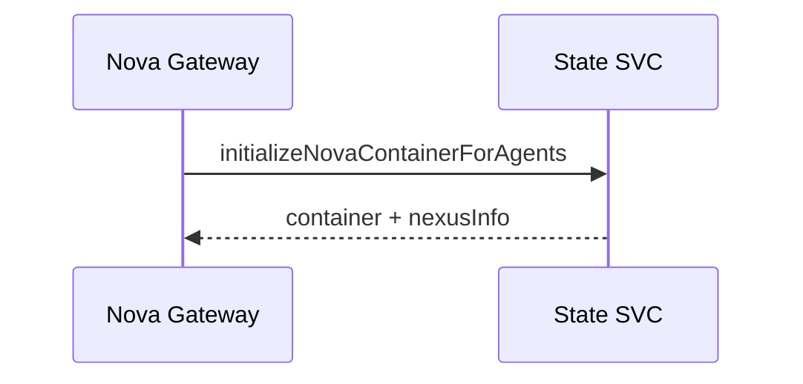

# Show me

Help the user understand the current topic visually.
With no argument, the topic is your last message: restate it.
Skip the preamble and keep prose brief.
Pick the smallest view that makes the key point clear.

Adapted from HumanLayer's `show-me` skill (MIT): https://www.humanlayer.com/blog/show-me-skill

## Plain words first

Open with one or two sentences, like one engineer talking to another.
No jargon the user didn't use first, no hedging, no recap of the conversation.
If a term is unavoidable, define it in a few words on first use.

## Pick a shape

- Show logic or an algorithm as pseudocode:

```text
on(save)
  if content is unchanged
    return cached result
  write new content
  return fresh result
```

- Show runtime control flow as a call tree:

```text
handleChat
  resolveAgentContainer
    InitializeAgentsAndUpdateCache
  checkAgentBudget
  proxy to agent
```

- Show UI structure as a component tree, including the state and module boundaries that matter:

```tsx
<SessionPage> (apps/example/src/routes/session.tsx)
  useSessionEvents()
  <SessionToolbar>
    <RunSkillButton> (packages/ui)
```

- Show file responsibility or a broad refactor as a shallow file tree:

```text
src/
├── commands/       # parses user actions
├── sessions/       # owns session state
└── transport/      # sends API requests
```

- Show interaction between services, or state, with Mermaid (sequence and state diagrams work best):



- Show what happens over time, or how something fails, as a timeline of one concrete case:

```text
t=0     lookup fails (context canceled)
        → cached as "no app" for 10m
t=0–10m Analyst chats go unbilled
t=10m   entry expires, next lookup succeeds
```

- Show "before vs. after" or "which case does what" as a small table:

| Case | master | this branch |
|---|---|---|
| Analyst | billed | billed |
| Flow | billed | not billed |
| lookup fails | harmless | unbilled for 10m |

- Use `diff` when the point is what changes and the surrounding shape already exists. Match the diff shape to the topic (call tree, file tree, component tree, pseudocode):

```diff
 handleChat
   resolveAgentContainer
+  checkAgentBudget
   proxy to agent
-  record budget
+  if billable: record budget
```

- Show the whole block when most of it is new, when omitted context would hide ownership or order, or when the user needs a copyable target shape:

```go
func billsAsAnalyst(t *graph.NexusAppType) bool {
	return t != nil && *t == graph.NexusAppTypeAuraAnalyst
}
```

- For a UI, layout, or concept too dense for Mermaid (or when the user says "as html"), write one focused HTML file: a diagram, an infographic, or a short slide deck, whichever fits the point.
  Match the product's colors, type, and spacing, use real labels and data, and make it readable on desktop and mobile.
  Write it to `/tmp/show-me-<description>.html` and open it with `xdg-open`.

## Guidance

- Place each visual next to the one or two sentences it supports.
- Use real names from the code or conversation, not placeholders.
- Keep only the calls, files, states, and boundaries needed to answer the current question, or the options for the current decision.
- One or two shapes usually do it. Don't use them all.
- End with the one thing that matters, or the question the user has to answer, if there is one.
