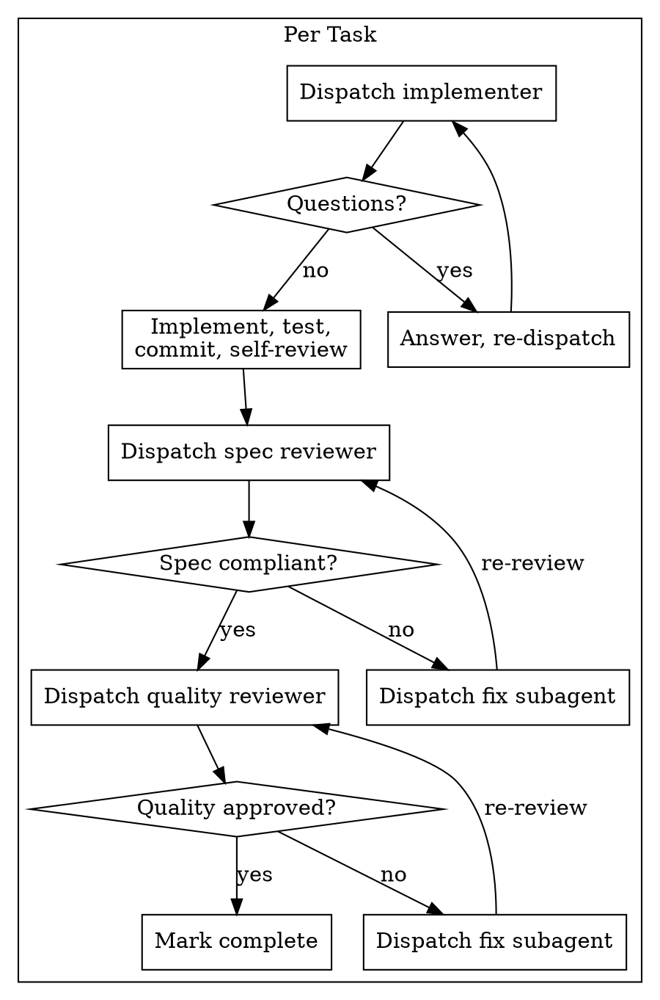

# Subagent-Driven Development

Fresh subagent per task + two-stage review (spec compliance → code quality) = high quality, no context pollution.

## When to Use

- Executing an implementation plan with independent tasks
- Referenced by `/implement-plan` for its per-task execution loop
- **Not for:** tightly coupled tasks requiring shared implementation context

## Per-Task Loop

## Key Principles

1. **Inline context** — Paste full task text into subagent prompts. Never make subagents read plan files.
2. **Spec before quality** — No point reviewing code quality if the wrong thing was built.
3. **Adversarial spec review** — Reviewer distrusts implementer report, reads actual code.
4. **Review-fix loops** — Issues found → fix subagent → re-review → repeat until clean. Never skip re-review.
5. **Fresh subagents** — Each dispatch is a clean context. Fix subagents are new dispatches, not resumed.

## Mode Integration (with /implement-plan)

| Mode | Per-task reviews | Phase review |
|------|-----------------|--------------|
| Deliberate | Full two-stage | Cross-task integration review |
| Standard | Full two-stage | Skipped (tasks already reviewed) |
| YOLO | Self-review only (in implementer) | Skipped |

## Prompt Templates

- `./implementer-prompt.md` — implements, tests, commits, self-reviews
- `./spec-reviewer-prompt.md` — verifies right thing was built
- `./code-quality-reviewer-prompt.md` — verifies it was built well

## Red Flags

**Never:**
- Dispatch parallel implementers on overlapping files
- Make subagent read plan file (paste text instead)
- Run quality review before spec compliance passes
- Proceed with unfixed review issues
- Skip re-review after fixes
- Let self-review replace external review

**If reviewer finds issues:** fix subagent → re-review → loop until approved.
**If subagent asks questions:** answer completely before proceeding.
**If subagent fails:** dispatch fresh fix subagent. Don't fix manually (context pollution).
