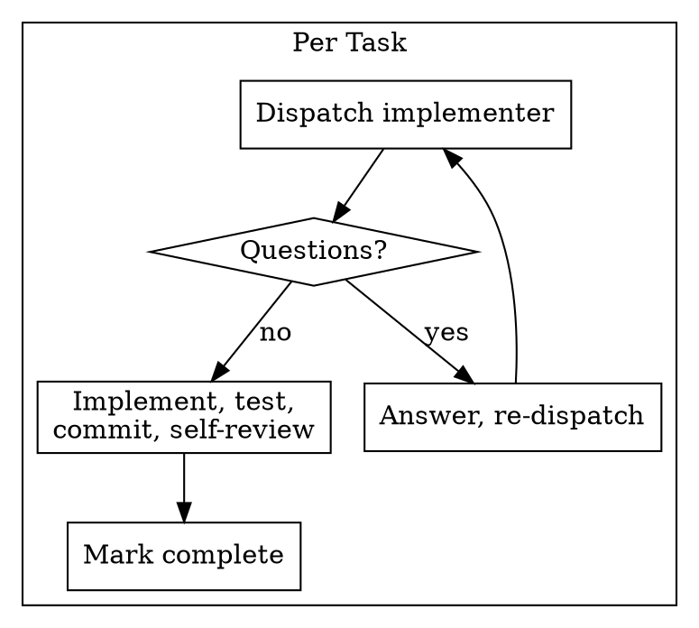

# Subagent-Driven Development

Fresh subagent per task, no context pollution. Review happens per PR, not per task, through the lanes in `~/.claude/skills/chi-mode/references/review-lanes.md`.

## When to Use

- Executing an implementation plan with independent tasks
- Referenced by `/implement-plan` for its per-task execution loop
- **Not for:** tightly coupled tasks requiring shared implementation context

## Per-Task Loop

```dot
digraph sdd {
    rankdir=TB;
    subgraph cluster_task {
        label="Per Task";
        impl [label="Dispatch implementer" shape=box];
        asks [label="Questions?" shape=diamond];
        answer [label="Answer, re-dispatch" shape=box];
        work [label="Implement, test,\ncommit, self-review" shape=box];
        done [label="Mark complete" shape=box];
    }
    impl -> asks;
    asks -> answer [label="yes"];
    answer -> impl;
    asks -> work [label="no"];
    work -> done;
}
```

## Key Principles

1. **Pointer-based dispatch** — Provide plan path and task number. Subagents read the plan file themselves. Only pass dependency summaries and file paths as direct context.
2. **Review per PR** — When a PR's last commit is verified, single-job lanes review it; see `review-lanes.md`.
3. **Fresh subagents** — Each dispatch is a clean context. Fix subagents are new dispatches, not resumed.

## Prompt Templates

- `./implementer-prompt.md` — implements, tests, commits, self-reviews

## Red Flags

**Never:**
- Dispatch parallel implementers on overlapping files
- Paste full task text into prompts (provide pointers; subagents read the plan file themselves)
- Proceed with unfixed review issues
- Skip a rerun that Reruns in `review-lanes.md` requires
- Let self-review replace external review

**If a lane finds issues:** the lead judgment in `review-lanes.md` picks what to fix → one fix subagent (`/implement-plan` Step 3c) → rerun only the lanes whose blockers or should-fixes it closes → two rounds at most, then the operator.
**If subagent asks questions:** answer completely before proceeding.
**If subagent fails:** dispatch fresh fix subagent. Don't fix manually (context pollution).
