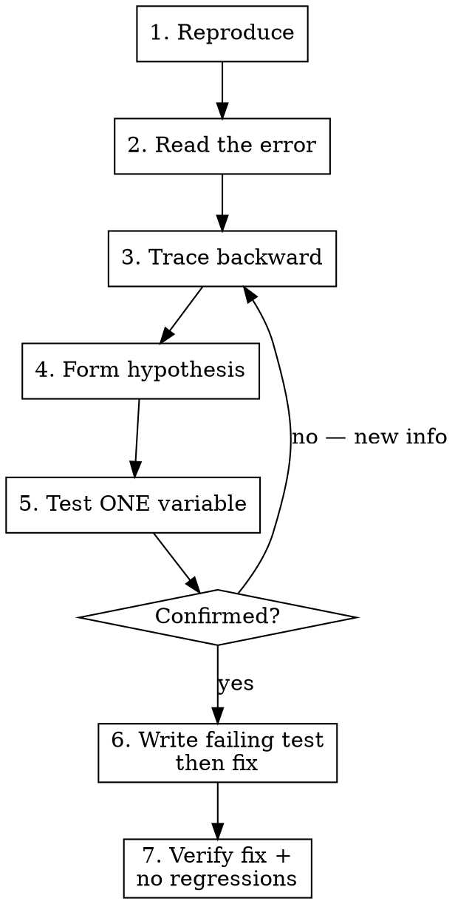

# Systematic Debugging

Find root cause first. Fix root cause only. Verify the fix proves the hypothesis.

## When to Use

- Test failures during implementation
- Runtime errors or unexpected behavior
- A subagent reports FAILED with an error
- Flaky tests, race conditions, timing issues
- "It works locally but not in CI" situations

**Not for:** known simple typos, missing imports, or obvious one-line fixes you can see directly.

## The Process

## Phase 1: Reproduce

Run the exact command that failed. Capture the full output. If you can't reproduce it, you can't fix it.

**If intermittent:** run it 3-5 times. Note which runs fail. Look for patterns (order-dependent? timing-dependent? state-dependent?).

## Phase 2: Read the Error

Read the COMPLETE error output. Not just the first line. Not just the assertion message.

Look for:
- **Stack trace** — which function, which line, which file
- **Actual vs expected** — what the test got vs what it wanted
- **Setup/teardown errors** — failure might be in test infrastructure, not your code
- **Multiple errors** — the first error is usually the root cause; later errors are cascading

## Phase 3: Trace Backward

Starting from the error location, trace backward through the call chain:

1. What function threw the error?
2. What called that function?
3. What data was passed in?
4. Where did that data come from?
5. Where does the data diverge from what was expected?

**Read the actual code at each step.** Do not guess what a function does — read it.

## Phase 4: Form a Hypothesis

State your hypothesis explicitly:

> "The error occurs because [X] passes [Y] to [Z], but [Z] expects [W] because [reason]."

A good hypothesis is:
- **Specific** — names a concrete cause, not "something is wrong with X"
- **Testable** — you can prove or disprove it with one action
- **Explains the evidence** — accounts for the error message and location

## Phase 5: Test ONE Variable

Change exactly one thing to test your hypothesis. Not two. Not three. One.

- Add a log/print at the suspected divergence point
- Hardcode the expected value to see if downstream works
- Comment out the suspected offending line

**If confirmed:** proceed to fix.
**If disproven:** you have new information. Return to Phase 3 with what you learned.

## Phase 6: Fix via Failing Test

1. Write a test that reproduces the bug (should fail)
2. Implement the minimal fix
3. Test passes

If you can't write a reproducing test, your understanding of the root cause is incomplete. Go back to Phase 3.

## Phase 7: Verify

1. Run the originally failing command — it should pass
2. Run the full test suite — no regressions
3. If the bug was in code you changed during implementation, re-run ALL success criteria from the task

## Anti-Patterns

| Temptation | Why It Fails |
|------------|-------------|
| Change multiple things at once | Can't tell which change fixed it. May mask a deeper issue. |
| Fix the symptom | Adding a nil check around a crash hides the real bug. The nil shouldn't exist. |
| "Shotgun debugging" — try random fixes | Wastes time, introduces new bugs, doesn't build understanding. |
| Skip reproducing ("I can see the bug in code") | You might be wrong. Reproduce first. |
| Read only the assertion line | The context around the error (setup, teardown, prior output) often contains the answer. |
| Assume your code is correct and the test is wrong | The test existed before your change. Your change is the new variable. |
| Add try/catch to suppress the error | The error is telling you something. Listen. |
| "It's probably a flaky test" | Maybe. Prove it by running 5 times. If it fails consistently, it's not flaky. |

## Red Flags — You're Off Track

Stop and reassess if:
- You've made 3+ changes without re-running the failing test
- You're modifying code unrelated to your hypothesis
- You're adding workarounds instead of fixing root cause
- You can't articulate your current hypothesis in one sentence
- You're fixing a second bug before confirming the first is resolved

**All of these mean: stop, re-read the error, re-trace, form a new hypothesis.**
